# Does anything CellenONE saw predict whether the cell sequenced?

**Short answer: no. Nothing tested separates PASS from FAIL.**

plate21 and plate22 pooled (same batch), 768 wells. Tested two ways, and both agree:

- **vs the three gate groups** (PASS / WARN / FAIL): 0 of 11 significant, smallest raw
  p = 0.31.
- **vs the raw read count** (Spearman): 0 of 11 significant, and every |rho| < 0.075.

Medians are near-identical across groups for every metric, and no metric tracks read
depth.

```bash
cd /tmp   # NOT the repo root — its .Rprofile activates renv and hides system ggplot2
Rscript /path/to/scDNA_pipeline/ad_hoc_checks/cellenone_vs_gate.R
```

Figures land in `docs/figures/cellenone_vs_gate/` (tracked, embedded below); the bulk data — a PDF with one
page per metric, and `wells_merged.tsv` — in `ad_hoc_checks/cellenone_vs_gate/`.

**The contamination indicator, which is the cleanest way to see the result:**

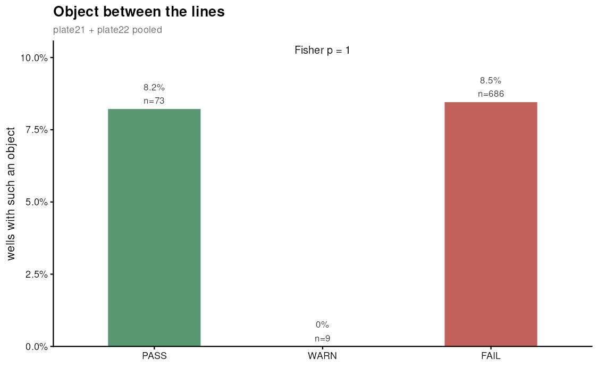

8.2 % of PASS wells and 8.5 % of FAIL wells have an object sitting in the ejection
zone. Fisher p = 1.00. An object that could have been co-ejected made no difference at
all to whether the cell sequenced.

---

## What was compared

Every well of both plates, grouped by **gate status** — the read-count verdict,
recomputed from the BAMs rather than scraped from a report:

| group | rule | n (pooled) |
|---|---|---|
| PASS | ≥ 100,000 usable reads | 73 |
| WARN | 50,000 – 99,999 | 9 |
| FAIL | < 50,000 | 686 |

Kruskal-Wallis across the three groups, pairwise Wilcoxon (BH) underneath, Fisher's
exact for the one binary metric. Non-parametric throughout: counts, bounded ratios and
skewed distances.

---

## Results

| metric | p | p (BH) | PASS vs FAIL | medians PASS / WARN / FAIL |
|---|---|---|---|---|
| Blue intensity | 0.31 | 1.00 | 0.81 | 50.8 / 55.8 / 50.1 |
| Elongation | 0.37 | 1.00 | 0.75 | 1.64 / 1.75 / 1.60 |
| Circularity | 0.39 | 1.00 | 0.75 | 1.06 / 1.08 / 1.05 |
| Isolated cell to green line | 0.46 | 1.00 | 0.38 | 104 / 198 / 137 |
| Objects in isolation window | 0.55 | 1.00 | 0.81 | 1 / 1 / 1 |
| Rightmost object diameter | 0.66 | 1.00 | 0.73 | 15.3 / 14.2 / 15.3 |
| Isolated cell diameter | 0.71 | 1.00 | 0.62 | 16.2 / 16.9 / 16.1 |
| Orange intensity | 0.75 | 1.00 | 0.74 | 35.0 / 38.8 / 36.3 |
| Objects detected | 0.92 | 1.00 | 0.98 | 1 / 1 / 1 |
| Nearest object past purple | 0.93 | 1.00 | 1.00 | 141 / 124 / 118 |
| Object between the lines | 1.00 | 1.00 | — | 8.2% / 0% / 8.5% |

**Which factor mattered most? None.** Every BH-corrected p is 1.00. The ordering above
is a ranking of noise. The contamination indicator is the clearest illustration:
**8.2 % of PASS wells and 8.5 % of FAIL wells have an object between the lines** —
Fisher p = 1.00. An object sitting in the ejection zone made no difference whatsoever
to whether the cell sequenced.

Pooling did not rescue anything. Tested per plate, the answer was the same (0 of 22
significant, smallest p 0.092).

### Every metric

Boxplot + jitter, Kruskal-Wallis annotated, n per group. Circles are plate21,
triangles plate22.

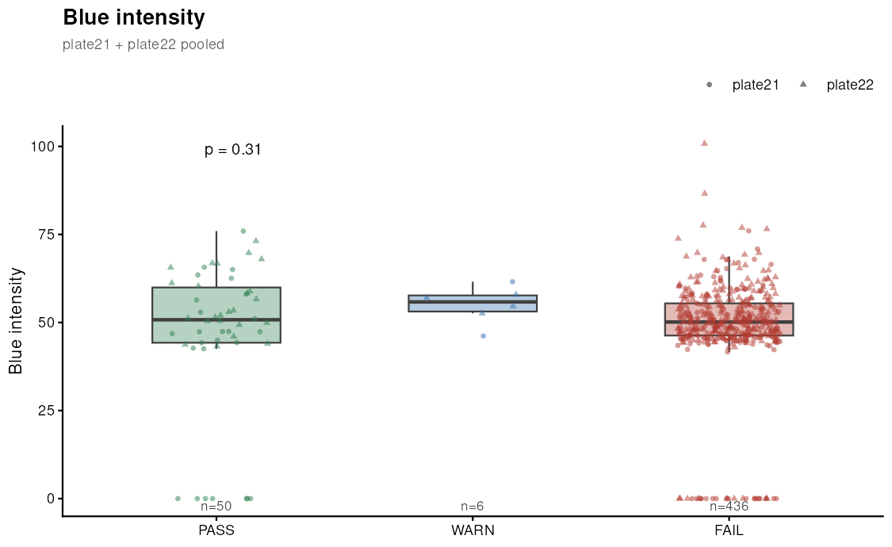
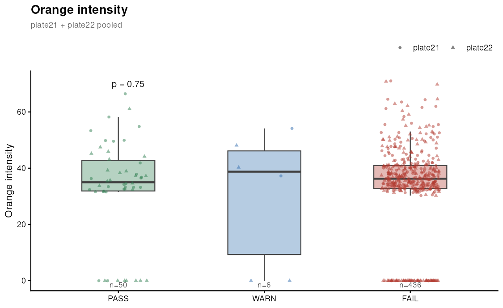
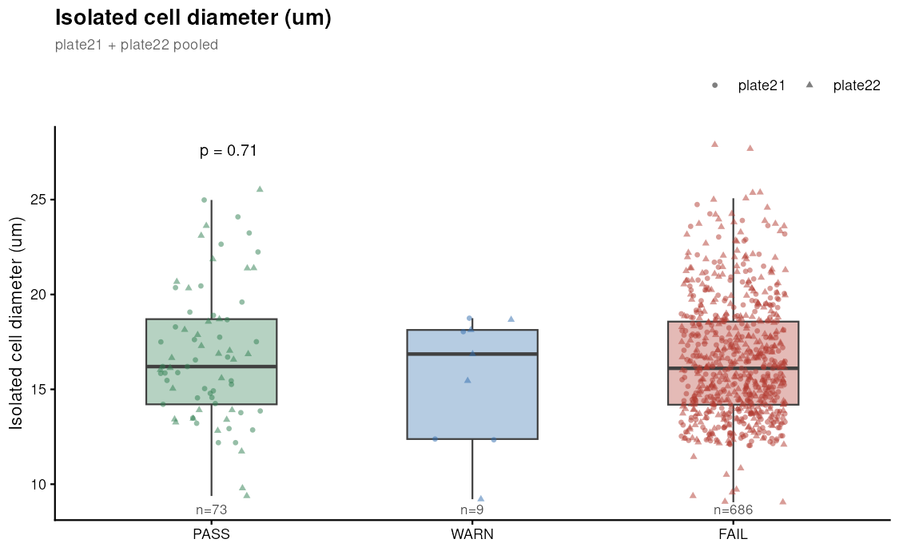
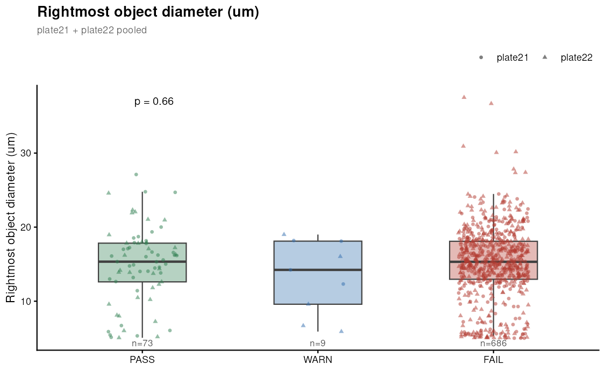
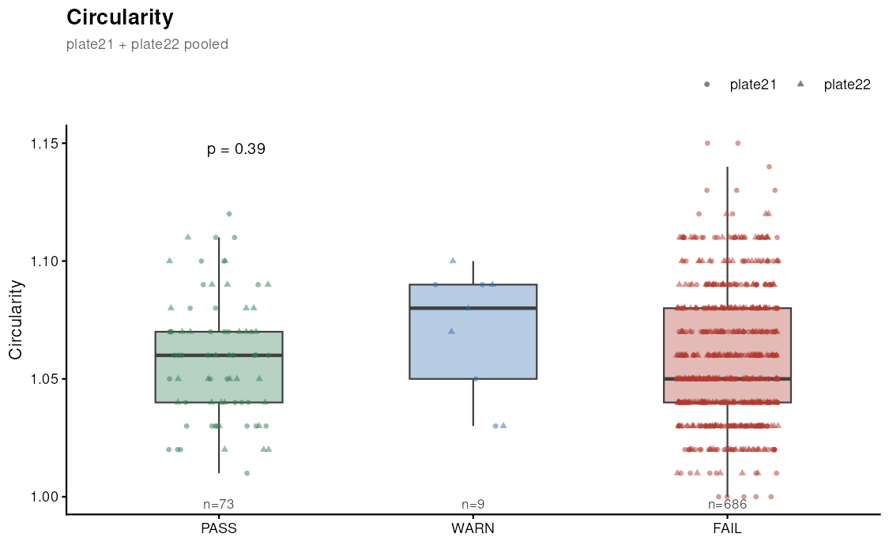
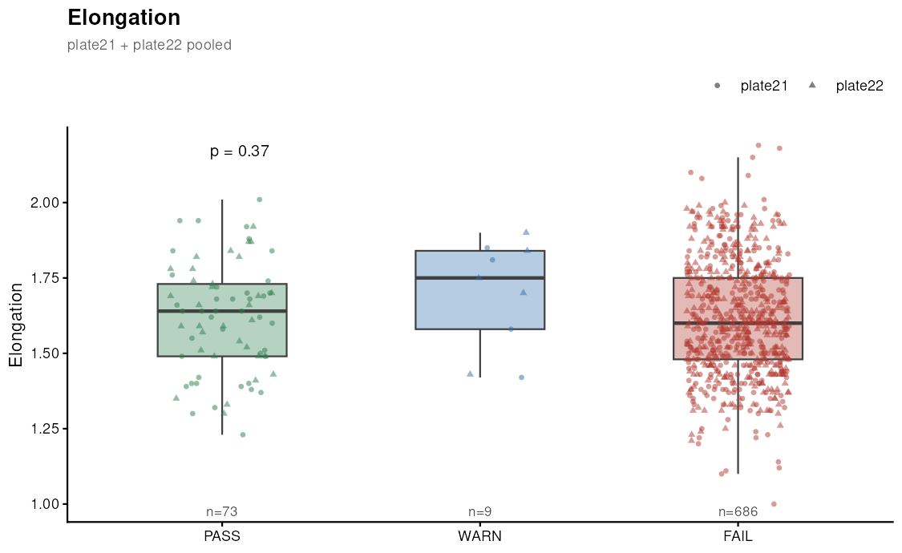
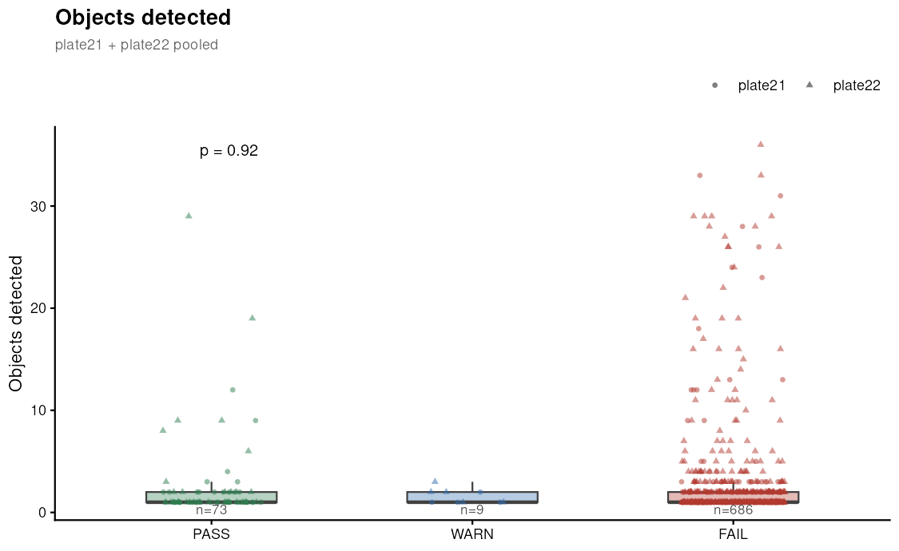
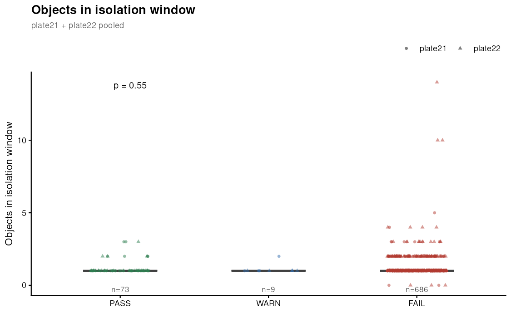
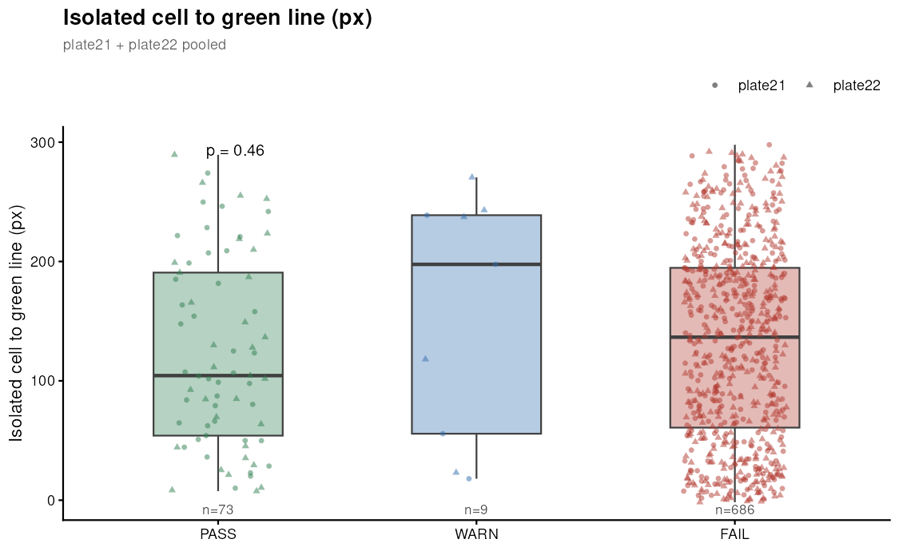
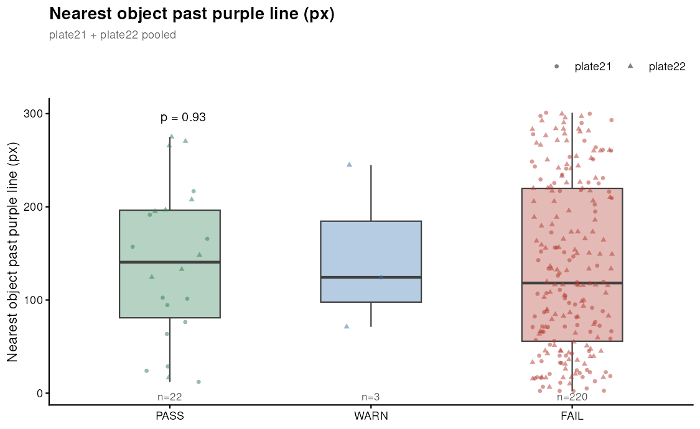

Read them as one picture: in every panel the three boxes sit on top of each other.

---

## Correlation against read count

The gate bins a continuous quantity into three groups, which throws information away —
so a modest association could in principle survive the binning and show up against raw
reads even when the three-way test finds nothing. It does not.

| metric | Spearman rho | p | p (BH) |
|---|---|---|---|
| Blue intensity | +0.073 | 0.11 | 0.96 |
| Object between the lines | +0.032 | 0.37 | 0.96 |
| Isolated cell to green line | −0.031 | 0.39 | 0.96 |
| Nearest object past purple | −0.053 | 0.41 | 0.96 |
| Orange intensity | −0.031 | 0.49 | 0.96 |
| Isolated cell diameter | +0.023 | 0.53 | 0.96 |
| Objects detected | +0.013 | 0.71 | 1.00 |
| Objects in isolation window | −0.011 | 0.75 | 1.00 |
| Circularity | +0.008 | 0.82 | 1.00 |
| Elongation | +0.004 | 0.91 | 1.00 |
| Rightmost object diameter | −0.0001 | 1.00 | 1.00 |

**Every correlation is essentially zero.** The largest, blue intensity at rho = +0.073,
explains 0.5 % of the variance and is not significant.

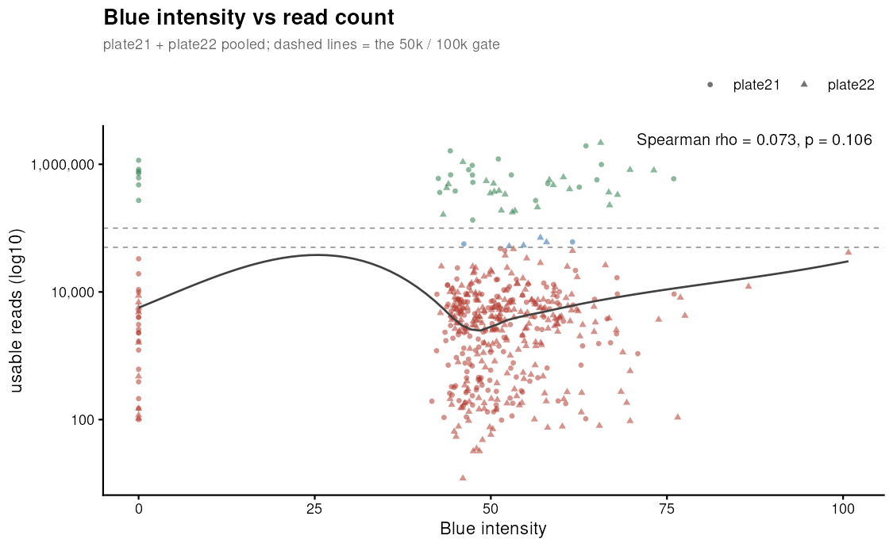

That panel is the whole result in one picture: the PASS wells (green, above the dashed
gate lines) sit at exactly the same blue intensities as the FAIL wells below them. The
loess curve wanders, but with rho = 0.07 it is tracing noise — do not read the dip.

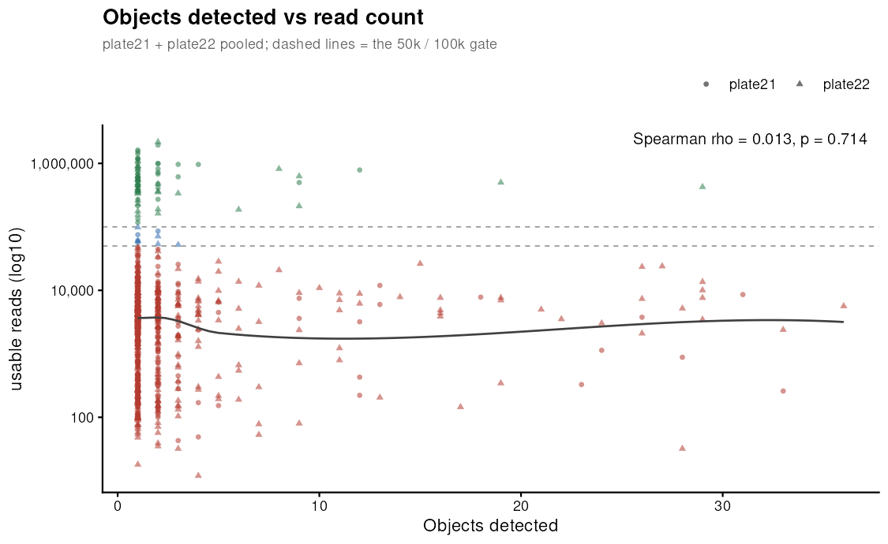

Same story for object count: wells with one object and wells with thirty span the same
range of read depth. A scatter for every metric is in `docs/figures/cellenone_vs_gate/*_vs_reads.png`.

---

## ⚠ The plates are not as interchangeable as assumed

Pooling was requested on the basis that both plates are the same batch and should
behave alike. Checking that assumption directly — plate21 vs plate22 **within the FAIL
wells**, the large comparable group — **6 of 11 metrics differ significantly between
the plates:**

| metric | plate21 vs plate22 (p) | what it is |
|---|---|---|
| **Objects detected** | **2 × 10⁻⁸** | our detection |
| **Blue intensity** | **2 × 10⁻⁵** | instrument measurement |
| **Object between the lines** | **2 × 10⁻⁴** | our detection |
| Orange intensity | 0.016 | instrument measurement |
| Nearest object past purple | 0.017 | our detection |
| Isolated cell diameter | 0.046 | instrument measurement |

The plate effect is visible in the panels above wherever you look at the jitter
shapes rather than the boxes — `Objects detected` is the starkest, where the entire
long tail is triangles:


This splits into two different problems:

- **The three "our detection" metrics are probably our fault, not biology.** plate22's
  detector finds far more, far smaller objects (median object Ø 6.9 µm vs plate21's
  13.4 µm, and six implausible > 100 µm blobs). `dark_threshold: 8` is likely too
  permissive for plate22's contrast. Until that is resolved, **object counts are not
  comparable across plates** and the pooled count-based rows above should be read as
  provisional.
- **The three instrument metrics are real differences between the plates** — genuinely
  different cells or staining. Fair to pool only if you accept the plates as one
  population, which this says they are not, quite.

The conclusion is unaffected either way: nothing separates the gate groups pooled *or*
split. But the pooled numbers rest on an assumption the data partly contradicts, and
that is worth knowing before quoting them.

---

## What each metric is

Provenance matters here and is easy to get wrong — see `CELLENONE_AND_QC.md` for the
full breakdown.

| metric | meaning | source |
|---|---|---|
| **Isolated cell diameter** | diameter of the cell CellenONE actually dispensed | instrument |
| **Circularity**, **Elongation** | shape of that same cell (elongation 1.0 = round) | instrument |
| **Blue / Orange intensity** | fluorescence of that cell per channel | instrument |
| **Objects detected** | how many objects *we* find in the droplet image | **derived** |
| **Objects in isolation window** | how many of those fall inside that well's own size gate | **derived** |
| **Rightmost object diameter** | see below | **derived** |
| **Isolated cell to green line** | `green_x − x` of the isolated cell, in pixels | **derived** |
| **Nearest object past purple** | `min(x − purple_x)` over objects beyond purple; NA if none | **derived** |
| **Object between the lines** | is any object in the ejection zone? | **derived** |

> **"Objects detected" is ours, not CellenONE's.** It appears in
> `cellenone/cellenone_wells.tsv` and in the report, but only because *we* put it
> there. Both of CellenONE's tables carry **exactly one Transmission row per printed
> well** — 384/384 in `isolated.xls` and 384/384 in `geoprops.xls`, zero with more. The
> instrument only ever describes the single cell it chose to dispense; it never counts
> what else was in the droplet. Every object beyond that one comes from our own pixel
> detection. The `cellenone/` folder is named after the instrument but holds *our*
> outputs; the instrument's raw files live in the `.Run` folder.

### "Rightmost Ø"

The diameter of **the object with the largest x** — furthest from the nozzle, furthest
*up* the capillary, therefore **least likely to be ejected**. It is the object the
droplet-call rule keys on:

| rightmost object sits | call |
|---|---|
| right of purple | `PASS` — the extra is safely up the capillary |
| between the lines | `CONTAMINATION` — it may be ejected too |
| left of green | `FAIL` — everything has already passed the ejection boundary |

**Not** the isolated cell's diameter. In a one-object well they coincide; in a
multi-object well the rightmost is the contaminant-risk object, not the cell of
interest.

### Two geometry facts behind the derived distances

- **The isolated cell is left of the green line in 384/384 wells on both plates**, so
  "distance to the green line" is always a positive distance behind the boundary.
- **Every between-the-lines object is non-isolated**, so that binary is cleanly a
  contamination indicator rather than the cell of interest sitting in the zone.

---

## Caveats

1. **Both plates sequenced badly** — 73 of 768 wells clear the gate. When ~90 % fail,
   failure is dominated by whatever is killing the library, and a droplet-quality
   signal would need to be very strong to show through. **This is not evidence that
   droplet quality never matters** — only that it did not drive the outcome here.
2. **WARN is n=9.** Powerless. Read the PASS-vs-FAIL column.
3. **Detection differs between plates** (see the warning above) — unresolved.
4. **plate22's isolation gate changed mid-run** (9–25, 9–30, 12–30 µm across three
   groups of wells), so `Objects in isolation window` is not measured against one
   consistent rule even within that plate. It is computed per well against that well's
   own gate, but the heterogeneity remains.
5. Two plates, one operator, one instrument. Exploratory.

---

## What follows

- **The droplet call should stay display-only**, which is how it is built. Nothing here
  justifies letting it gate anything, and the pipeline correctly keeps read counts as
  the sole driver of `auto_status` and the pre-filled decision.
- **The image panel is still worth having — as forensic context.** When a well fails,
  the image answers "was there even a cell in there?", which the read count cannot.
  That is a different job from prediction.
- **The detection-sensitivity difference is the one actionable finding.** It is a
  pipeline problem, not a biological one, and it needs settling before object counts
  can be compared across plates.
- **Nothing here is predictive, on either test.** Group comparison and correlation
  against raw read depth both come back empty, so this is not an artefact of how the
  gate bins wells.
- **A predictive metric cannot come from this dataset.** It would need plates where a
  decent fraction of wells actually sequence, so there is contrast to model against.

For contrast: across everything examined in this project, the only measurement with
even a weak association with yield was **mean GC content** (Spearman ρ = +0.20) — a
sequencing metric, not a CellenONE one.
